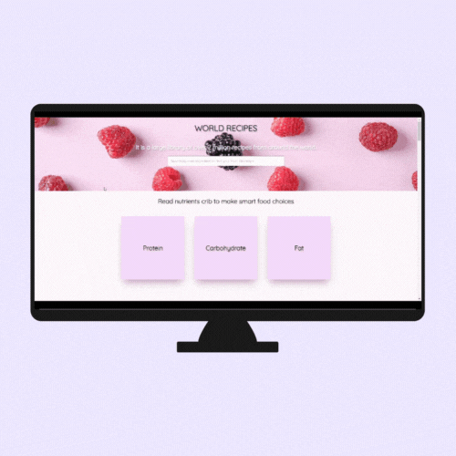

👋 I'm Angelina Bushueva, a newbie front-end developer diving deep into React to create cool stuff on the web. I've got a good handle on HTML, CSS, and JavaScript, and now I'm all about building awesome user interfaces with React.

🚀 Right now, I'm focusing hard on React—it's like Lego for making websites! I'm also learning about Redux for managing data and Node.js for the back-end stuff.

💡 When I'm not coding, you can catch me checking out new design ideas and keeping up with what's hot in web development. I love working with others and learning new things, so let's team up and make some web magic!

🌟 Drop me a line, and let's build some awesome stuff with React together!

🖥️ See my portfolio at **<a href="https://angelina-bush.glitch.me/">My Portfolio</a>**

✉️ You can contact me at **<a href="mailto:asbushuevaa@mail.ru">My Email</a>**

## Tech Stack

  
  
  
  
  
  
  
  
  
  
  
  

## My Projects

 
